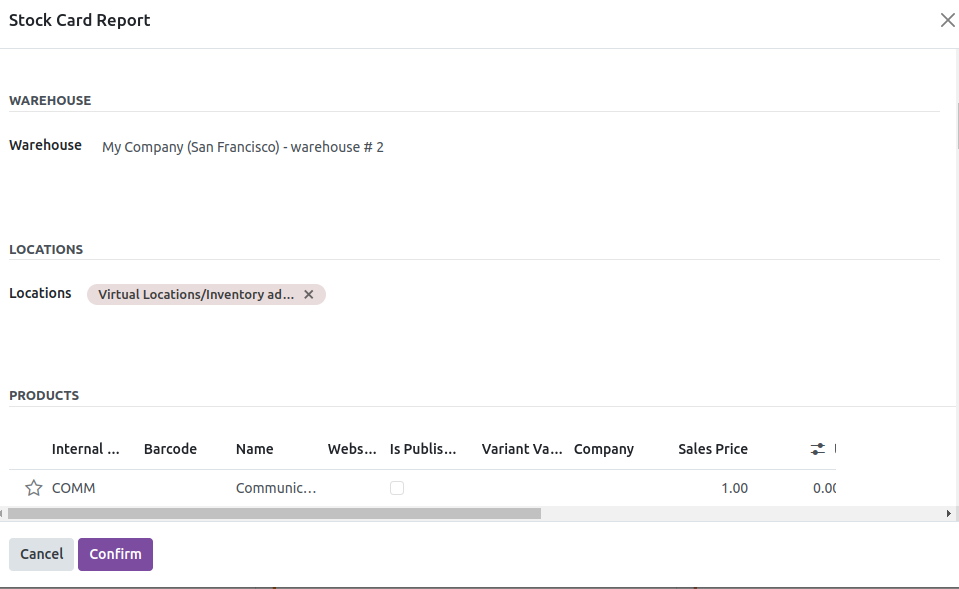

Stock Card Report Module for Odoo
=================================

Generate detailed stock card reports with ease using the Stock Card Report module. This module allows you to filter and generate inventory reports across multiple companies, warehouses, locations, and more. Perfect for detailed stock management and inventory tracking.

Key Features
------------

- **Output in Excel**: Get the output in an Excel file listing products or that quantity.
- **Multi Company**: Specific Company Wise Inventory Report.
- **Warehouse Filtering**: Option to filter by Warehouse (One at a time).
- **Location Filtering**: Option to filter by Location.
- **Product Filtering**: Option to filter by Product.
- **Inventory Valuation**: Option for Inventory Valuation.
- **Detailed Transactions**: Get Opening, Incoming, Outgoing, Internal, Adjustment and Closing for a given date range.
- **Stock Valuation**: Get stock valuation report on date.
- **Real-Time Reports**: Generate Stock Inventory Real-Time Report in Excel by specific dates.
- **Highlight Negative Stock**: Highlight negative stock record in red color (if selected).
- **Zero Quantity Stock**: With and Without Zero quantity stock.

Screenshots
-----------

Report Menu
~~~~~~~~~~~

Filter Options
~~~~~~~~~~~~~~

Excel Report Example
~~~~~~~~~~~~~~~~~~~~

Installation
------------

1. Clone the repository::

    git clone https://github.com/AnandShah10/stock_card_report.git

2. Place the module in your Odoo ``addons`` directory.
3. Update the module list and install the ``Stock Card Report`` module from the Odoo apps.

Usage
-----

1. Navigate to the **Reporting** menu.
2. Select **Stock Card Report** from the dropdown.
3. Use the filters provided to customize your report.
4. Click on **Generate Report** to get the Excel file.

License
-------

This project is licensed under the GPL-3 License - see the ``LICENSE`` file for details.

Contributing
------------

1. Fork the repository.
2. Create your feature branch (``git checkout -b feature/fooBar``).
3. Commit your changes (``git commit -am 'Add some fooBar'``).
4. Push to the branch (``git push origin feature/fooBar``).
5. Create a new Pull Request.

---

For more details, please contact the author at `shahanand1072004@gmail.com <mailto:shahanand1072004@gmail.com>`_.
